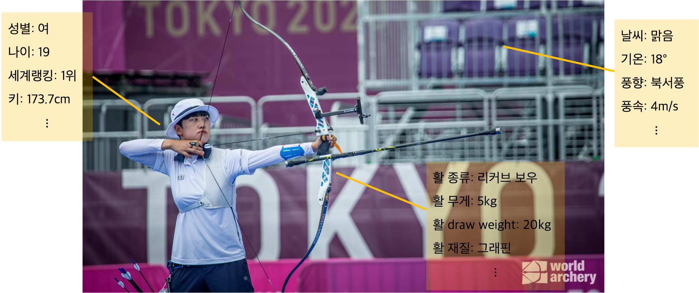
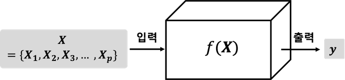
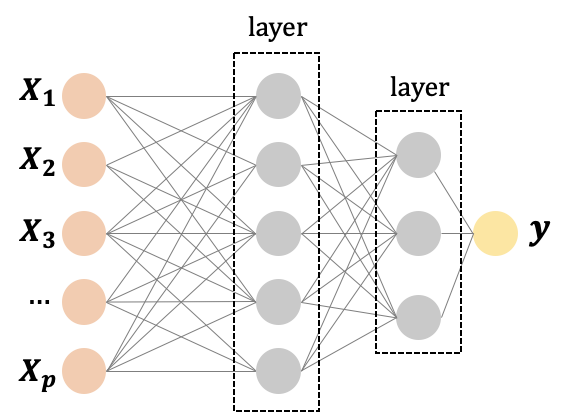

```
[딥러닝 사전]은 이런 분들에게 유용한 글입니다.

🙋머신러닝/딥러닝 공부를 시작하면서 '용어' 장벽에 막힌 적 있으신 분
🙋🏽뭔가 개념은 알겠는데 비슷한 용어가 너무 많아서 '내가 제대로 알고 있는게 맞나?'하고 찝찝했던 분
🙋무턱대고 수식부터 나오는 개념 설명에 어지러우셨던 분

이건 100프로 문돌이였던 제가 산업공학 대학원에 입학해 머신러닝/딥러닝 공부에 입문하면서 부딪혔던 물음입니다. 대학원을 마치면서 그간 공부한 내용을 한차례 정리해보고자 딥러닝 사전을 써봅니다. 누군가에게는 도움이 되길 바라며, 보신 후 질문이나 의견, 지적사항 있다면 댓글 무조건 환영합니다. 
```


## 머신러닝 vs 딥러닝

네이버 검색창에 ‘머신러닝’을 치면, 바로 첫 연관 검색어로 ‘딥러닝’이 뜹니다. 그만큼 머신러닝과 딥러닝 차이가 헷갈리는 분이 많다는 거겠죠?

저도 처음 대학원에 입학했을 때 제가 공부하고픈 내용을 자습한 후 멘토에게 발표하는 시간이 있었는데, 이때 가장 처음 준비해 간 것이 이 둘의 차이입니다.

그럼 꼭 기억해야 할 주요 포인트를 짚어가며 설명 시작하겠습니다.

#### Point 1. 머신러닝은 컴퓨터에게 ‘문제’와 ‘정답’을 학습시키는 것이다

둘의 차이를 알기 위해선 먼저 머신러닝이 무엇인지 에서부터 출발해야 합니다. 

*Machine learning*, 직역하면 ‘기계학습’이죠. 즉, 기계를 학습시킨다는 것입니다. 기계에게 무엇을 학습시킨다는 뜻일까요?

아래 예시를 통해 이 질문에 답해보도록 하겠습니다. 



(사진 출처: https://worldarchery.sport/news/200398/preview-womens-finals-tokyo-2020-olympic-games, 기재된 내용은 사실과 상관없이 임의로 작성함)

도쿄올림픽에서 레전드 오브 레전드가 된 안산 선수 사진을 가져와봤습니다. 올림픽 당시 어떤 양궁 선수에게 양궁의 매력이 뭐냐고 물었더니 “양궁은 다른 누구와도 아닌 나 스스로와의 싸움”이라고 답한 인터뷰를 본 적 있습니다. 주어진 장소와 날씨에서 오로지 선수 스스로 활을 어떻게 다루느냐에 따라 과녁에서의 점수가 결정될 것이기 때문입니다.

자, 그럼 양궁 경기에서 궁사가 현재 쏘는 **화살이 몇 점을 맞추게 될지 예측하는 머신러닝 모델**을 만든다고 해봅시다.

우리가 궁금한 문제와 정답은 아래와 같겠죠.

+ 문제 : A 선수가 쏜 화살이 몇 점을 맞출 것인가?

+ 정답 : __점(0~10점 중 하나)

하지만 우리의 모델이 이 문제를 맞추게 하려면 모델에게 몇가지 정보를 줘야겠죠? 저는 양궁 전문가는 아니지만, 화살의 점수에 영향을 미치는 변수들을 데이터화 한다면 그림에 표시한 것과 같이 이런 것들이 있을 것 같습니다.

+ 날씨: 기온, 풍향, 풍속 등

+ 활: 종류, 무게, draw weight, 재질 등

+ 선수: 나이, 성별, 랭킹, 키, 몸무게 등

+ 기술: 팔의 각도, 활 시위를 당기는 힘 등

이 모든 변수는 활이 활시위를 떠나는 순간 특정값을 갖게 될 것입니다. 위 사진에 기재된 값 같은 것들이요. 그렇다면 이 정보들을 이용해 우리는 문제를 다시 구성할 수 있습니다. 

- 문제: 기온이 18도, 풍향이 북서풍, 풍속이 4m/s, 무게 5kg의 활, ….로 쏜 화살은 몇 점에 맞춰질 것인가?

이를 표(table) 형태로 정리하면 아래와 같습니다. (정답이 10점인 경우입니다.)

| 기온 | 풍향 | 풍속 | ...  | 활 종류 | 무게 | ...  | 선수 나이 | 성별 | ...  | 점수 |
| :--: | :--: | :--: | :--: | :-----: | :--: | ---- | :-------: | :--: | ---- | :--: |
|  18  | 북서 |  4   |      | 리커브  |  5   |      |    19     |  여  |      |  10  |

표에서 *점수* (정답)를 제외한 모든 정보는 결국 점수에 영향을 미치는 변수들입니다. 영향을 어떤 식으로 미치는지, 즉 변수들과 점수 간에 정확히 어떤 연관관계가 있는지 그 **관계식**을 알아야만 새로운 선수가 활을 쏠 때 해당 활이 몇 점 과녁에 꽂힐지 예측할 수 있을 것입니다. 이 관계식을 찾는 것이 우리의 목표입니다.

하지만 위 **모든 변수를 아우르는 관계식**이 정확히 무엇인지 밝히라고 하면 아무리 훌륭한 양궁 선수라 해도 해내지 못할 것입니다. 

예를 들어 '북서풍이 10m/s 이상으로 불 때는 선수가 팔을 수평보다 오른쪽으로 3도 기울여야 10점을 쏜다.'라는 관계가 있다고 해보죠. 머신러닝이 제안되기 전 예측 모델은 이렇게 사람이 일일이 경험을 통해 발견한 **규칙(rule)**을 상정해 학습시킨 뒤 실제와 가장 가까운 규칙을 찾아내는 식으로 모델링이 이뤄졌다고 합니다. 이걸 규칙 기반(rule-based) 또는 지식 기반(knowledge-based) 방식이라고 합니다. 

머신러닝은 이런 소모적인 방식을 획기적으로 바꿉니다. 즉, 기계에 **변수(문제), 그리고 정답만 입력**시키면 그 **연관관계는 기계가 알아서 학습** 하도록 한 것입니다. 규칙이 사라진 자리는 데이터가 메웁니다. 즉, 기계가 복잡한 관계식을 풀어낼 수 있도록 규칙 대신 수많은 데이터('빅데이터')를 입력하는 것이죠.  위의 예에서 만약 선수 100명이 각 100번씩 활을 쏘면 총 10000개의 데이터가 모일텐데, 기계에 10000쌍의 변수와 정답을 주기만 하면 기계가 둘 사이의 관계식을 찾아내는 것이죠. 그리고 기계는 새로운 선수가 활을 쏘는 것을 보고 앞서 찾아낸 관계식에 따라 그 화살이 몇점을 맞출지 예측할 수 있게 되는 것입니다.

이걸 간단한 수학적 개념으로 나타내면 아래와 같습니다. 



다들 중학교 때 함수 배우셨죠? X를 넣으면 반드시 그에 해당하는 결과값 y를 내뱉어주는 게 함수잖아요. 앞에서 계속 말한 **관계식은 곧 함수(f)**를 말하는 것이고, 입력하는 **변수는 X**, 그리고 이 함수가 내뱉어야 하는 **정답은 y**가 됩니다. 변수는 여러가지이니 위 그림에서 왼쪽처럼 표현할 수 있고요. 다시 말하지만 머신러닝은 우리가 가진 데이터(X와 y로 구성된)들에 내재된 복잡한 관계를 찾는 것을 목표로 한다고 했으니, 결국 데이터를 설명할 **단 하나의 함수**를 찾는 작업이라고 할 수 있겠습니다.

여기서 중요한 점은 **'결국 모든 머신러닝의 목적은 예측'**이라는 것입니다. 위 예시에선 경기 점수를 예측하는 것. '음성인식'에서는 주어진 소리(X)가 무슨 단어(y)인지 예측하는 것. '이미지 분류'는 주어진 그림(X)이 무슨 그림인지(y) 예측하는 것이죠. 모두 문제와 정답, X와 y가 있는 형태이고요. 이 문제와 정답에 해당하는 수많은 데이터를 입력한 뒤, 유사한 경우에 대한 정답을 맞추는 것이 머신러닝의 목표라 할 수 있겠습니다.

#### Point 2. 딥러닝은 머신러닝의 한 방법이다.

그렇다면 딥러닝은 무엇일까요? *Deep Learning*, 직역하면 ‘깊게 학습한다’는 것입니다. 이 뜻에서부터 알 수 있듯이 딥러닝은 **머신러닝을 하는 방식**을 의미합니다. 즉 머신러닝의 방법론 중 한 갈래입니다.

머신러닝은 입력값 X와 정답 y 간의 연관관계를 가장 잘 표현할 함수를 찾는 것이라고 했습니다. 이 함수는 여러 모양을 띌 수 있지만 머신러닝의 주류라고 할 수 있는 구조는 **인공 신경망** 구조입니다. Artificial Neural Network 또는 그냥 Neural Network, 줄여서 뉴럴넷이라고도 부릅니다. 사람 뇌 속 뉴런들의 모습과 비슷하다고 해서 이렇게 부르게 된 것인데 이유는 아래 그림을 보시면 아실 수 있습니다.

일단 인공 신경망의 초기 형태는 퍼셉트론(perceptron, 1958), 그리고 다층 퍼셉트론(multi-layer perceptron, 1986)입니다. 다층 퍼셉트론, MLP는 아래와 같이 생겼습니다.



MLP의 구체적인 작동 방식은 다른 글에 설명하고, 여기서도 입력값 X가 이 신경망에 들어가면 정답에 대한 예측값 y를 출력하게 된다는 것만 계속 기억해주시면 됩니다. 기본적으로 위 MLP의 수많은 **선**들은 각 변수들의 일종의 가중치 역할을 합니다. 그리고 **층(layer)**을 몇 개 쌓느냐에 따라 얼마나 복잡한 함수로 나타낼 것인지 그 정도를 정하게 됩니다. 층을 많이 쌓을수록 많은 가중치를 사용해 복잡한 함수를 찾게 되겠죠.

MLP가 처음 제안된 1980년대부터 바로 효과적인 구조라고 인정받은 것은 아니라고 합니다. 처음엔 한계가 많았다고 합니다. 하지만 연구자들은 MLP에 층을 점점 더 쌓아 '깊게' 만들었습니다. 그렇게 만들어진 4층 이상인 MLP를 깊은 신경망(Deep Neural Network)이라고 칭하고, 이런 **깊은 신경망을 학습시키는 알고리즘**을 **딥러닝**이라고 부르게 됩니다. 여기서 알고리즘이라 함은 신경망 구조뿐 아니라 활성화 함수(나중에), 목적 함수(역시 나중에) 등 이 신경망을 학습하기 위한 방법론 일체를 아우릅니다. (하지만 주로 '딥러닝 모델'이란 말을 많이 쓰고 이때는 아래 설명처럼 깊은 신경망 모델 자체를 가리킵니다.)

깊은 신경망과 딥러닝 아이디어가 나온 1980년대 이후로 신경망 구조를 더 깊게 만들고 + 세부 구조를 조금씩 변형 + 학습 방식을 다변화하는 연구들이 이어지게 됩니다. 이런 노력 끝에 2000년대 들어 머신러닝을 아주 훌륭하게 해내는 딥러닝 알고리즘이 나오기 시작했죠. 특히 2012년 신경망에 합성곱 연산(Convolution)을 도입해 구조를 변형한 Convolutional Neural Network(CNN, 역시 나중에) 기반의 모델 AlexNet이 대규모 이미지 분류 대회인 ILSVRC에서 압도적 우승을 거두면서 **딥러닝의 부활**을 알리게 됩니다.

참고: https://medium.com/neuralmagic/2012-a-breakthrough-year-for-deep-learning-2a31a6796e73

이후 딥러닝은 전방위 분야에서 시도, 발전되고 있습니다. 최신 SOTA급 성능을 보이는 모델들은 빠른 컴퓨팅 파워에 힘입어 **수백개 층을 사용할 정도**로 깊어지고 있고, 이 때문에 일부에서는 다시 가볍고 빠른 모델들을 찾는 움직임도 이뤄지고 있습니다. 또한  빅데이터를 활용한 많은 과제들이 무거운 딥러닝 모델까지 사용하지 않더라도 **기존 머신러닝 모델들로도 충분한 성능**을 보이기도 합니다. 물론 여전히 딥러닝 분야에서 연구될 것들이 너~무 많이 남아 있어 당분간은 딥러닝의 시대라는 것은 확실하겠죠.

그럼 이번 글은 여기서 마치겠습니다. 다음 글에서 만나요!

------

참고한 것들

- <기계학습>, 오일석 저
- 핵심 머신러닝(김성범 교수님) https://youtube.com/playlist?list=PLpIPLT0Pf7IoTxTCi2MEQ94MZnHaxrP0j

